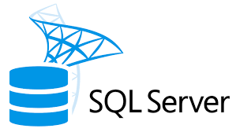

# 👋 Hello, I'm Maria Lykoudi!

Welcome to my GitHub profile! I'm a **Junior Data Analyst**.

---

## 🎨 About Me
- 🌱 Transitioning from a successful archaeology career to data analytics.
- ✍️ Passionate about creating data-driven stories and impactful visualizations.
- 📸 Lover of photography, art museums, and quality time with family and friends.

---

## 🌟 Skills & Tools

### Programming Languages  

  
  
  

### Data Visualization  

  

### Databases  

  
  

### Other Tools  

  
  
  

---

## 📊 Featured Projects

### ☕ [Brewing Insights: Coffee Customer and Offer Performance Analysis](#)  
- **Objective:** Analyze customer behavior and offer performance to uncover trends and insights.  
- **Tools:** Power BI, Python  
- **[Explore the project ➡️](#)** https://github.com/marialyk77/Coffee_Customer_Offer_Performance_Analysis.git
  
### 🚀 [Air Flight Delay Analysis](#)
- **Objective:** Analyze flight delay data to uncover patterns and provide actionable insights.
- **Tools:** Python, Matplotlib, SQL
- **[Explore the project ➡️](#)** https://github.com/marialyk77/Airline_Flight_Delay.git

### 🥑 [Avocado Sales Data](https://github.com/marialyk77/Avocado_Sales.git)
- **Objective:** Analyze avocado sales data to uncover trends, purchasing patterns, and growth trajectories.
- **Tools:** Python, Pandas, Matplotlib
- **[Explore the project ➡️](https://github.com/marialyk77/Avocado_Sales.git)**

### 📉 [World Economic Indicators & Greek Economic Crisis](#)
- **Objective:** Investigate economic indicators during the Greek economic crisis.
- **Tools:** Power BI, SQL
- **[Explore the project ➡️](#)** https://github.com/marialyk77/World_Economic_Indicators_and_Greek_Economic_Crisis.git

---

## 🛠️ Currently Preparing For  
- **Microsoft PL-300 Exam**: Power BI Data Analyst Certification  

---

## 🌐 Let's Connect!
Feel free to connect with me:  
  
  

